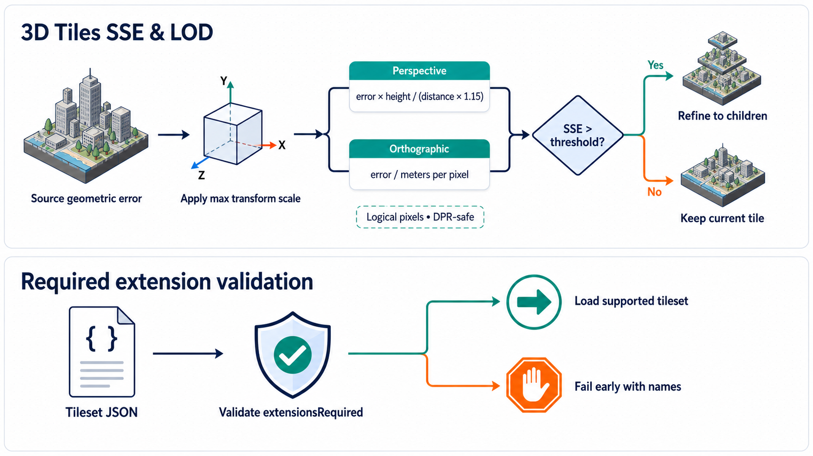

import {Tiles3DDocsTabs} from '@site/src/components/docs/tiles-3d-docs-tabs';

# Screen-Space Error and Level of Detail

<Tiles3DDocsTabs active="sse-lod" />

3D Tiles organizes content in a spatial hierarchy. A parent tile provides a coarser representation of an area, while its descendants provide progressively more detail. `Tileset3D` traverses this hierarchy for every viewport and uses **screen-space error (SSE)** to decide whether a tile is detailed enough to render or should refine to its children.

This guide describes the loaders.gl 3D Tiles calculation. It also explains how projection, transforms, display pixel density, and traversal options affect the selected level of detail (LOD).



References:

- [3D Tiles specification: geometric error](https://docs.ogc.org/cs/22-025r4/22-025r4.html#core-geometric-error)
- [`Tileset3D` API](/docs/modules/tiles/api-reference/tileset-3d)
- [`Tile3D` API](/docs/modules/tiles/api-reference/tile-3d)
- [`Tiles3DLoader` API](/docs/modules/3d-tiles/api-reference/tiles-3d-loader)

## From Geometric Error to Refinement

Each 3D Tiles tile declares a `geometricError`. It estimates, in meters, the largest geometric deviation introduced by rendering that tile instead of its descendants. A large value describes a coarse approximation; leaf tiles normally have an error of zero.

Geometric error is a world-space distance. It becomes useful for a particular view only after it is projected into pixels:

1. Load the tile's source geometric error.
2. Convert it to world-space meters using the tile's complete transform.
3. Project the world-space error into logical viewport pixels to obtain SSE.
4. Compare SSE with `maximumScreenSpaceError`.
5. Refine when the tile's SSE is greater than the allowed maximum and usable descendants exist.

A lower `maximumScreenSpaceError` demands greater visual accuracy and generally loads more tiles. A higher value accepts a coarser approximation and generally reduces requests, memory, and drawing work.

## Perspective SSE

Perspective projection makes an object appear smaller as its distance from the camera increases. loaders.gl uses this approximation:

```text
perspectiveSSE =
  (worldGeometricError * viewportHeight * viewDistanceScale) /
  (distanceToCamera * sseDenominator)
```

| Term | Units | Meaning |
| --- | --- | --- |
| `worldGeometricError` | meters | Tile error after applying the complete transform scale. |
| `viewportHeight` | logical pixels | Height of the deck.gl viewport. |
| `viewDistanceScale` | unitless | Application-controlled multiplier; defaults to `1`. |
| `distanceToCamera` | meters | Shortest distance from the camera to the tile bounding volume. |
| `sseDenominator` | unitless | Perspective projection factor, currently fixed at `1.15`. |
| `perspectiveSSE` | logical pixels | Estimated visible error used for traversal. |

The distance is clamped to a small positive value when the camera is inside or extremely close to the tile, avoiding division by zero while still requesting detail.

### Perspective Example

Assume:

- world geometric error: `8 m`
- viewport height: `900 px`
- camera distance: `600 m`
- `viewDistanceScale`: `1`
- denominator: `1.15`

```text
perspectiveSSE = (8 * 900) / (600 * 1.15) = 10.43 px
```

With `maximumScreenSpaceError: 8`, the tile exceeds the tolerance and should refine. With a threshold of `16`, the tile is acceptable. Moving the camera to `300 m` doubles SSE to approximately `20.87 px`, making refinement more likely.

## Dynamic Perspective SSE

Perspective views can spend substantial bandwidth and memory refining distant tiles near the
horizon. At street level, those tiles cover a large traversal distance but their finest details
often contribute little to the final image. Dynamic screen-space error (dynamic SSE) applies a
fog-like reduction after the normal perspective calculation:

```text
fogStrength = 1 - exp(-((distanceToCamera * effectiveDensity) ^ 2))
dynamicReduction = fogStrength * dynamicScreenSpaceErrorFactor
adjustedPerspectiveSSE = perspectiveSSE - dynamicReduction
```

`effectiveDensity` starts with `dynamicScreenSpaceErrorDensity` and is attenuated by two
view-dependent factors:

- **Camera direction:** a horizontal, horizon-facing view receives the strongest reduction. The
  reduction fades to zero as the camera points vertically.
- **Camera height:** the reduction is strongest near the lower part of the root tileset volume. It
  fades to zero as the camera rises above the volume. `dynamicScreenSpaceErrorHeightFalloff`
  controls where that fade begins.

The calculation uses geodetic heights for a root `region` and earth-scale bounding volumes. Local
tilesets use their root transform and source-space z-up height. Density is recalculated for every
viewport and traversal frame, so multiple views do not share camera-dependent state.

| Option | Default | Meaning |
| --- | --- | --- |
| `dynamicScreenSpaceError` | `true` | Enables the optimization for perspective 3D Tiles traversal. |
| `dynamicScreenSpaceErrorDensity` | `0.0002` | Base fog density in inverse meters. Higher values reduce distant SSE sooner. |
| `dynamicScreenSpaceErrorFactor` | `24` | Maximum SSE reduction in logical pixels. |
| `dynamicScreenSpaceErrorHeightFalloff` | `0.25` | Fraction of root height where density begins to fade, clamped to `[0, 1]`. |

These defaults follow Cesium's tuned street-level behavior. Dynamic SSE does not change the base
perspective formula, its fixed denominator, or `viewDistanceScale`; it only subtracts the
view-dependent reduction afterward. Set `dynamicScreenSpaceError: false` when exact unadjusted
perspective SSE is required or when comparing traversal results with an older loaders.gl release.

### Dynamic SSE Example

Assume the normal perspective calculation produces `30 px` SSE for a horizon tile at `3,000 m`.
The camera is low and horizontal, so the effective density equals its default `0.0002`:

```text
fogStrength = 1 - exp(-((3000 * 0.0002) ^ 2)) = 0.3023
dynamicReduction = 0.3023 * 24 = 7.26 px
adjustedPerspectiveSSE = 30 - 7.26 = 22.74 px
```

With `maximumScreenSpaceError: 16`, this tile still refines. More distant horizon tiles receive a
larger reduction and stop earlier. Looking downward or moving above the tileset drives effective
density toward zero, restoring the unadjusted `30 px` result.

## Orthographic SSE

Orthographic projection does not make geometry smaller with camera distance. Its LOD calculation therefore uses the viewport's world-space pixel size directly:

```text
orthographicSSE =
  (worldGeometricError * viewDistanceScale) / metersPerPixel
```

| Term | Units | Meaning |
| --- | --- | --- |
| `worldGeometricError` | meters | Transform-scaled tile error. |
| `viewDistanceScale` | unitless | Application-controlled LOD multiplier. |
| `metersPerPixel` | meters per logical pixel | World-space size represented by one viewport pixel. |
| `orthographicSSE` | logical pixels | Estimated visible error used for traversal. |

An orthographic viewport must expose `orthographic: true` and a positive, finite `metersPerPixel`. A structural third-party viewport that identifies itself as orthographic but does not provide a usable scale falls back to the established perspective calculation instead of producing `NaN` or infinite SSE.

### Orthographic Example

For a tile with `8 m` world geometric error and a viewport scale of `0.5 m/px`:

```text
orthographicSSE = 8 / 0.5 = 16 px
```

Changing only the camera distance does not change this value. Zooming the orthographic scale to `0.25 m/px` doubles SSE to `32 px`, so traversal selects more detail.

## Logical Pixels and Device Pixel Ratio

SSE is expressed in the same logical/CSS pixels used by deck.gl viewport width, height, and `metersPerPixel`. A browser may render each logical pixel with multiple physical device pixels, but that device pixel ratio has already been accounted for by the rendering stack.

loaders.gl therefore does not divide or multiply SSE by `window.devicePixelRatio`. Applying an additional DPR correction would make the same camera and logical viewport select different tiles on standard- and high-density displays. Applications that construct custom viewports should likewise provide dimensions and `metersPerPixel` in logical-pixel units.

## Transforms and Geometric Error

A tile's `transform` maps its local coordinates into its parent's coordinate system. The root also inherits the tileset `modelMatrix`. loaders.gl composes the full transform before calculating the world-space geometric error:

```text
worldGeometricError = sourceGeometricError * maximumComputedTransformScale
```

The maximum of the X, Y, and Z scale components is used for non-uniform transforms. This is conservative: if one dimension is enlarged more than the others, traversal must retain enough detail for that largest dimension. Rotation and translation do not change geometric error.

The source error is stored separately from its transformed value. When a model matrix changes at runtime, loaders.gl always recalculates from the source error. It never scales an already-scaled value, so repeated updates cannot compound the error.

When a malformed or legacy child omits its LOD metric, it inherits the ancestor's source metric before applying its own complete transform. This preserves the same non-compounding invariant.

## Refinement Modes

SSE decides whether a tile needs more detail; the tile's `refine` mode determines how parent and child content are combined.

- `REPLACE`: qualifying descendants replace the coarser parent once the required child content is ready. The runtime may temporarily retain the parent to avoid holes while children load.
- `ADD`: qualifying descendants render in addition to the parent. This is common when each level contributes new features rather than replacing a complete surface.

Both modes use the same SSE threshold. They differ in rendering and loading continuity, not in the definition of geometric error.

## From Desired LOD to Request Order

SSE determines which hierarchy levels are needed. When several needed tiles compete for network slots, progressive and foveated measurements decide which requests start first without changing the final SSE target. See [Request scheduling and priorities](./request-scheduling-and-priorities) for the complete model, including foveated requests and moving-camera deferral.

## Tuning LOD

The two primary controls are:

- `maximumScreenSpaceError` defaults to `8`. Lower values refine more aggressively; higher values accept coarser tiles.
- `viewDistanceScale` defaults to `1`. It multiplies SSE. Values above `1` refine more aggressively; values between `0` and `1` stop earlier.

Start with `maximumScreenSpaceError`. It has an intuitive interpretation as tolerated logical pixels and is easier to compare across tilesets. Use `viewDistanceScale` when an application needs a global quality multiplier without replacing its chosen threshold.

Tune dynamic SSE only after choosing those global quality controls. Increase
`dynamicScreenSpaceErrorDensity` when distant horizon tiles refine too deeply, or increase
`dynamicScreenSpaceErrorFactor` when the maximum reduction is too small. Lower either value when
distant structures appear too coarse. Height falloff is mainly useful for local tilesets whose
street-level and aerial views need different traversal depth.

After selecting an acceptable final LOD, tune streaming behavior separately with the [request-scheduling guide](./request-scheduling-and-priorities), then size the [cache and memory budget](./caching-and-memory).

Changing either value affects more than visual sharpness. Deeper traversal can increase request count, decode work, GPU memory, cache churn, and draw calls. Tile availability, network latency, refinement mode, byte-native cache budgets, and memory-adjusted SSE can delay or limit the visible effect of an SSE change. See [Caching and memory](./caching-and-memory).

## Runtime Inspection

The following `Tile3D` properties are useful when diagnosing selection:

- `tile.lodMetricValue`: world-space geometric error for 3D Tiles after transform scaling.
- `tile.distanceToCamera`: distance used by perspective SSE.
- `tile.screenSpaceError`: most recently calculated SSE.
- `tile.selected`: whether the tile was selected for the current traversal frame.
- `tile.refine`: whether descendants add to or replace the tile.
- `tileset.dynamicScreenSpaceErrorComputedDensity`: effective density for the most recently
  traversed viewport; zero means the current view receives no dynamic reduction.

Compare a tile's `screenSpaceError` with the tileset's `maximumScreenSpaceError`. If refinement is expected but does not occur, also check that descendants exist, their content is available, the tile is inside the culling and request volumes, and traversal has run again after asynchronous content loading.

## Troubleshooting

| Symptom | Likely cause | What to inspect or change |
| --- | --- | --- |
| Tiles stay visibly coarse | SSE threshold is high, `viewDistanceScale` is low, or child content is unavailable. | Lower `maximumScreenSpaceError`, restore `viewDistanceScale` toward `1`, and inspect child requests. |
| Too many tiles load | SSE threshold is low or `viewDistanceScale` is high. | Raise `maximumScreenSpaceError` and monitor requests and memory. |
| Distant horizon tiles refine too deeply | Dynamic SSE is disabled, its density is too low, or the camera is above the root volume. | Enable dynamic SSE, inspect the computed density, and tune density or height falloff. |
| Distant buildings look too coarse | Dynamic density or factor is too high for the dataset. | Lower `dynamicScreenSpaceErrorDensity` or `dynamicScreenSpaceErrorFactor`. |
| Aerial and street-level views select the same deep LOD | The root height range or height falloff does not distinguish the camera positions. | Inspect the root bounding volume and lower `dynamicScreenSpaceErrorHeightFalloff`. |
| A scaled-up model under-refines | Geometric error is not using the model's world scale. | Confirm the model matrix reaches `Tileset3D` and inspect `tile.lodMetricValue`. |
| LOD changes after repeated transform updates | A derived error is being scaled repeatedly. | Ensure updates start from the source geometric error; loaders.gl does this automatically. |
| Orthographic LOD changes with camera distance | The viewport is missing `orthographic: true` or valid `metersPerPixel`. | Inspect the viewport contract and its scale units. |
| Orthographic traversal returns `NaN` or extreme values | `metersPerPixel` is zero, negative, or non-finite. | Supply a positive finite value; loaders.gl otherwise uses its perspective-compatible fallback. |
| High-DPI displays select different tiles | Physical and logical pixels are being mixed in a custom viewport. | Provide CSS/logical dimensions and do not apply another DPR factor. |
| Lowering SSE does not immediately improve detail | Children are still loading or constrained by memory and scheduling. | Wait for load callbacks, retraverse, and inspect cache/request limits. |

## Current Boundaries

- The perspective denominator is currently fixed at `1.15`, corresponding approximately to the established 60-degree field-of-view assumption. Perspective behavior is intentionally preserved for compatibility rather than derived from every possible projection matrix.
- Orthographic SSE requires `metersPerPixel`; invalid values use the perspective-compatible fallback.
- Dynamic SSE is a perspective optimization. It is not subtracted from orthographic SSE, including
  the perspective-compatible fallback used when an orthographic viewport has an invalid pixel scale.
- Request-priority behavior is documented separately because it controls arrival order rather than final LOD.
- 3D Tiles geometric error is measured in meters. I3S uses a different `maxScreenThreshold` LOD metric that is already screen-oriented and is not transform-scaled by this logic.
- SSE controls refinement after visibility and request-volume checks. It cannot make a culled tile visible or provide descendants that are missing from the tileset.
