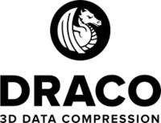

import {DracoDocsTabs} from '@site/src/components/docs/draco-docs-tabs';
import {DocPageHeader} from '@site/src/components/docs/doc-page-header';
import {DocOrientation, ReferenceBoundary} from '@site/src/components/docs/designed-doc';

<DocPageHeader
  eyebrow="Compressed geometry format"
  title="Ship geometry without throwing away its attributes."
  description="Draco compresses meshes and point clouds for transport. loaders.gl exposes the decoder and writer behind the same typed geometry boundary used by glTF, 3D Tiles, I3S, and standalone workflows."
  tone="violet"
  meta={['Meshes', 'Point clouds', 'Typed attributes']}
  links={[
    {label: 'Draco module', to: '/docs/modules/draco'},
    {label: '3D data formats', to: '/docs/developer-guide/3d-data-formats'}
  ]}
/>

<DracoDocsTabs active="overview" />

<DocOrientation
  eyebrow="The compressed payload"
  title="Keep the geometry contract. Reduce the bytes."
  description="The format preserves the logical mesh or point-cloud attributes while using quantization and compression to reduce delivery size. The remaining limits are explicit in the support matrix."
  tone="violet"
  items={[
    {label: 'Input', value: 'Mesh or point-cloud attributes'},
    {label: 'Codec', value: 'Draco JavaScript or WebAssembly runtime'},
    {label: 'Output', value: 'Typed arrays and geometry metadata'},
    {label: 'Used by', value: 'glTF, 3D Tiles, I3S, and direct loaders'}
  ]}
/>

- _[`@loaders.gl/draco`](/docs/modules/draco)_ - loaders.gl implementation
- _[Draco3D](https://google.github.io/draco/)_ - Open-source library for compressing and decompressing 3D geometric meshes and point clouds.

<ReferenceBoundary
  title="Draco attributes and compatibility"
  description="The sections below cover use cases, supported geometry types, attribute data types, and the current decoder and writer boundaries."
  tone="violet"
/>

## Use cases

While possible to use independently, Draco compression is primarily used to compress geometries in glTF files and also in tiled 3D formats such as 3D Tiles and I3S.

## Supported Features

- Supports meshes and point clouds.

| Mesh Type     | Supported |
| ------------- | --------- |
| `MESH`        | ✅        |
| `POINT_CLOUD` | ✅        |

The official 1.5.7 JavaScript binding does not expose `AddInt64Attribute`,
`AddUInt64Attribute`, or `AddFloat64Attribute`, and it has no corresponding
typed-array classes for decoder extraction. loaders.gl therefore rejects
64-bit attributes explicitly rather than narrowing them silently. A future
Draco binding that exposes those APIs can be adopted after adding matching
typed output and conformance coverage.

## Draco Attribute Support

| Attribute Type    | `DracoLoader` | `DracoWriter` | JS Type        |
| ----------------- | ------------- | ------------- | -------------- |
| `DT_INT8` (1)     | ✅            | ✅            | `Int8Array`    |
| `DT_UINT8` (2)    | ✅            | ✅            | `Uint8Array`   |
| `DT_INT16` (3)    | ✅            | ✅            | `Int16Array`   |
| `DT_UINT16` (4)   | ✅            | ✅            | `Uint16Array`  |
| `DT_INT32` (5)    | ✅            | ✅            | `Int32Array`   |
| `DT_UINT32` (6)   | ✅            | ✅            | `Uint32Array`  |
| `DT_INT64` (7)    | ❌            | ❌            | `Int64Array`   |
| `DT_UINT64` (8)   | ❌            | ❌            | `Uint64Array`  |
| `DT_FLOAT32` (9)  | ✅            | ✅            | `Float32Array` |
| `DT_FLOAT64` (10) | ❌            | ❌            | `Float64Array` |
| `DT_BOOL` (11)    | ❌            | ❌            | N/A            |

Notes:

- Multiple attributes of the same Draco category are preserved. If an attribute has no explicit
  metadata name, the loader assigns collision-free names such as `COLOR_0`, `COLOR_1`,
  `TEXCOORD_0`, and `TEXCOORD_1`.
- `Float64` and other 64 bit formats are not valid for glTF geometry attributes, These are normally only used for "extra" attributes. 64 bit attributes can appear when converting LAS files with metadata to glTF or 3D Tiles, see [CesiumJS blog](https://cesium.com/blog/2024/03/20/preserving-more-metadata-for-point-clouds-using-3dtiles/)
- loaders.gl ignores unsupported attributes.

## Draco Metadata Support

- Metadata dictionaries are available both on the mesh and also on each attribute.
- Supports all Draco metadata field types, including:

| Metadata Field | Supported |
| -------------- | --------- |
| `Int32Array`   | ✅        |
