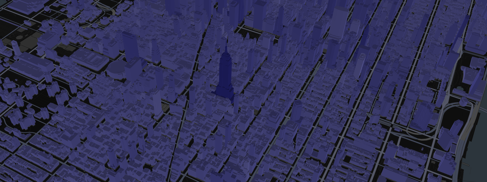

# Attribute-driven colorization

<p class="badges">
  
</p>

In I3S, a feature represents a real-world object within a node. For example, a building within a 3D object scene layer. Node resources such as geometry buffer and attributes can belong to a feature and can be accessed by an object-ID.

In terms of geometry, every vertex of a mesh is associated with some feature. At the same time, every feature is associated with feature attribute values. For example, there might be `HEIGHT` attribute that stores roof height information about every building.

All that means that it is possible to make some visual effects related to attribute value. It might be text labels, colors, opacity etc.

From 3.4 version loaders.gl provides attributes colorization capability that allows colorization of node mesh by some attribute value.

The complete case of attributes colorization is done in [I3S Explorer](https://i3s.loaders.gl/viewer?tileset=new-york). It is an open source ReactJS application. See source code on [GitHub](https://github.com/visgl/loaders.gl-showcases).



## Find out layer's attributes

It is necessary to pick some attribute to colorize a layer by. So it is necessary to load the layer JSON:

```javascript
import {load} from '@loaders.gl/core';
import {I3SLoader} from '@loaders.gl/i3s';

const i3sLayer = await load(url, I3SBuildingSceneLayerLoader);
```

List and types of attributes might be taken from [`i3sLayer.fields`](https://github.com/Esri/i3s-spec/blob/master/docs/1.9/field.cmn.md) and [`i3sLayer.attributeStorageInfo`](https://github.com/Esri/i3s-spec/blob/master/docs/1.8/attributeStorageInfo.cmn.md) properties.

## Setup colorization scale

Attributes colorization capability applies linear color gradient. To create this gradient attribute values range is required.

To get minimum and maximum attribute values [statistics](https://github.com/Esri/i3s-spec/blob/master/docs/1.9/statisticsInfo.cmn.md) can be used. The [statistics info JSON](https://github.com/Esri/i3s-spec/blob/master/docs/1.9/statsInfo.cmn.md) has min and max values. Usage of those values allows setting true attribute values range not clamping extremum values.

As soon as statistics info is stored in separate resources, it has to be loaded in a separate request. Statistics is just a JSON data and can be loaded with JSONLoader:

```javascript
import {load} from '@loaders.gl/core';
import {JSONLoader} from '@loaders.gl/loader-utils';

const attributeStats = await load(`${url}/statistics/f_5/0`, JSONLoader);
```

## Use I3SLoader with `colorsByAttribute` option

To colorize a dataset I3SLoader has to be used with `colorsByAttribute` option:

```
  import { StaticMap } from "react-map-gl";
  import DeckGL from "@deck.gl/react";
  import { Tile3DLayer } from "@deck.gl/geo-layers";
  import { I3SLoader } from "@loaders.gl/i3s";

  function renderLayer() {
    const loadOptions = {
      i3s: {
        colorsByAttribute: {
          attributeName,
          minValue: statistics.min,
          maxValue: statistics.max,
          minColor: [146, 146, 252, 255], // #9292FC
          maxColor: [44, 44, 175, 255], // #2C2CAF
        },
      },
    };
    return new Tile3DLayer({
      id: `tile3d-layer-${layer.id}`,
      data: url,
      loader: I3SLoader,
      loadOptions,
    });
  }

  <DeckGL
    id={id}
    layers={renderLayers()}
    viewState={viewState}
    onViewStateChange={onViewStateChangeHandler}
  >
    <StaticMap reuseMaps mapStyle={mapStyle} />
  </DeckGL>
```

## Colorization mode

Attributes colorization capability can work in 2 modes: 'replace' and 'multiply'.

`replace` mode. Attribute-based colors replace geometry vertex colors. This is the default mode.

`multiply` mode. Attribute-based colors multiply with geometry vertex colors.

Usage example:

```javascript
function renderLayer() {
  const loadOptions = {
    i3s: {
      colorsByAttribute: {
        attributeName,
        minValue: statistics.min,
        maxValue: statistics.max,
        minColor: [146, 146, 252, 255], // #9292FC
        maxColor: [44, 44, 175, 255], // #2C2CAF
        mode: 'multiply' // or 'replace'
      }
    }
  };
  return new Tile3DLayer({
    id: `tile3d-layer-${layer.id}`,
    data: url,
    loader: I3SLoader,
    loadOptions
  });
}
```
