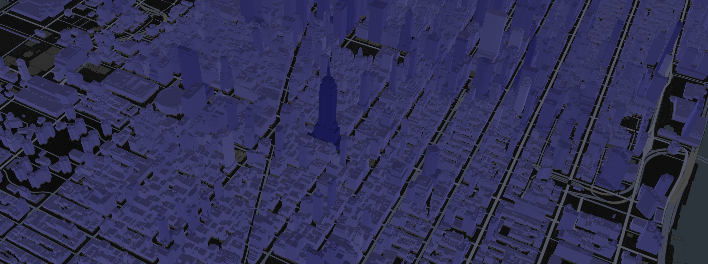

# Attribute-driven colorization

import Demo from 'examples/website/i3s-colorization-by-attributes/src/app';

<div style={{height: '50vh'}}>
  <Demo />
</div>
Please find source code of the example [here](https://github.com/visgl/loaders.gl/tree/master/examples/website/i3s-colorization-by-attributes)

In I3S, a feature represents a real-world object within a node. For example, a building within a 3D object scene layer. Node resources such as geometry buffer and attributes can belong to a feature and can be accessed by an object-ID.

In terms of geometry, every vertex of a mesh is associated with some feature. At the same time, every feature is associated with feature attribute values. For example, there might be `HEIGHT` attribute that stores roof height information about every building.

All that means that it is possible to make some visual effects related to attribute value. It might be text labels, colors, opacity etc.

The complete case of attributes colorization is done in [I3S Explorer](https://i3s.loaders.gl/viewer?tileset=new-york). It is an open source ReactJS application. See source code on [GitHub](https://github.com/visgl/loaders.gl-showcases).



## Find out layer's attributes

It is necessary to pick some attribute to colorize a layer by. So it is necessary to load the layer JSON:

```javascript
import {load} from '@loaders.gl/core';
import {I3SLoader} from '@loaders.gl/i3s';

const i3sLayer = await load(url, I3SBuildingSceneLayerLoader);
```

List and types of attributes might be taken from [`i3sLayer.fields`](https://github.com/Esri/i3s-spec/blob/master/docs/1.9/field.cmn.md) and [`i3sLayer.attributeStorageInfo`](https://github.com/Esri/i3s-spec/blob/master/docs/1.8/attributeStorageInfo.cmn.md) properties.

## Setup colorization scale

Attributes colorization capability applies linear color gradient. To create this gradient attribute values range is required.

To get minimum and maximum attribute values [statistics](https://github.com/Esri/i3s-spec/blob/master/docs/1.9/statisticsInfo.cmn.md) can be used. The [statistics info JSON](https://github.com/Esri/i3s-spec/blob/master/docs/1.9/statsInfo.cmn.md) has min and max values. Usage of those values allows setting true attribute values range not clamping extremum values.

As soon as statistics info is stored in separate resources, it has to be loaded in a separate request. Statistics is just a JSON data and can be loaded the following way:

```ts
import {fetchFile} from '@loaders.gl/core';
import {StatsInfo} from '@loaders.gl/i3s';

const dataResponse = await fetchFile(`${url}/statistics/f_5/0`);
const data = JSON.parse(await dataResponse.text());
const stats: StatsInfo | null = (data?.stats as StatsInfo) || null;
```

## Use @deck.gl-community/layers

To colorize an I3S dataset on the fly you have to use `DataDrivenTile3DLayer` from `@deck.gl-community/layers`. First of all you need to add `@deck.gl-community/layers` into the project:

```bash
yarn add @deck.gl-community/layers
```

Then you can use `DataDrivenTile3DLayer`, `colorizeTile` util function as a prop `customizeColors` of the layer and set prop `colorsByAttribute` with required params (attribute name, min/max values, min/max colors, mode):

```ts
import Map from 'react-map-gl';
import maplibregl from 'maplibre-gl';
import DeckGL from "@deck.gl/react";
import {DataDrivenTile3DLayer, colorizeTile} from '@deck.gl-community/layers';
import {I3SLoader} from "@loaders.gl/i3s";

function renderLayers() {
  const loadOptions = {i3s: {coordinateSystem: COORDINATE_SYSTEM.LNGLAT_OFFSETS}};
  const colorsByAttribute = {
    attributeName,
    minValue: stats.min,
    maxValue: stats.max,
    minColor: [146, 146, 252, 255], // #9292FC
    maxColor: [44, 44, 175, 255], // #2C2CAF
    mode: 'replace'
  }
  const layers = new DataDrivenTile3DLayer({
    data: url,
    loader: I3SLoader,
    onTilesetLoad: onTilesetLoadHandler,
    loadOptions,
    colorsByAttribute,
    customizeColors: colorizeTile
  });

  return layers;
}

<DeckGL initialViewState={viewState} layers={renderLayers()} controller>
  <Map
    reuseMaps
    mapLib={maplibregl}
    mapStyle={style}
  />
</DeckGL>
```

## Colorization mode

Attributes colorization capability can work in 2 modes: 'replace' and 'multiply'.

`replace` mode. Attribute-based colors replace geometry vertex colors.

`multiply` mode. Attribute-based colors multiply with geometry vertex colors.

Usage example:

```ts
function renderLayers() {
  const loadOptions = {i3s: {coordinateSystem: COORDINATE_SYSTEM.LNGLAT_OFFSETS}};
  const colorsByAttribute = {
    attributeName,
    minValue: stats.min,
    maxValue: stats.max,
    minColor: [146, 146, 252, 255], // #9292FC
    maxColor: [44, 44, 175, 255], // #2C2CAF
    mode: 'multiply' // or 'replace'
  };
  const layers = new DataDrivenTile3DLayer({
    data: url,
    loader: I3SLoader,
    onTilesetLoad: onTilesetLoadHandler,
    loadOptions,
    colorsByAttribute,
    customizeColors: colorizeTile
  });

  return layers;
}
```
