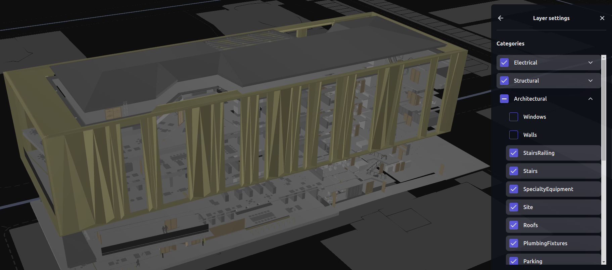
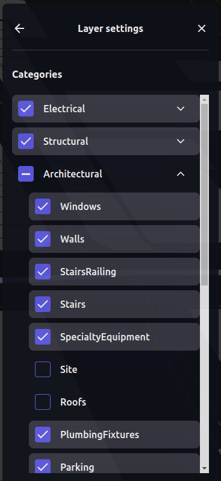

# I3S Building Scene Layer (BSL)

import Demo from 'examples/website/i3s-building-scene-layer/src/app';

<p class="badges">
  
</p>

<div style={{height: '50vh'}}>
  <Demo />
</div>
Please find source code of the example [here](https://github.com/visgl/loaders.gl/tree/master/examples/website/i3s-building-scene-layer)

A building scene layer can represent 3D model content based on BIM structuring disciplines such as architectural or structural, and categories such as windows or walls. In I3S [specification](https://github.com/Esri/i3s-spec) BSL is a layer type.

BSL doesn't have content resources. It is a composite layer that consists of multiple sublayers. Every sublayer can be: `group`, `3DObject` or `Point`.

`group` sublayer is also just a composite layer. It contains further levels of sublayers and provides a nested structure for BSL. As a result, BSL has a tree-like sublayers structure with `3DObject` and `Point` layers;

`3DObject` and `Point` sublayers are content layers. Those layer types are separated types of layers in I3S spec and can be used independently. Loaders.gl supports `3DObject` layer types and doesn't support `Point`.

## BSL visualization with deck.gl

I3S `3DObject` layer is shown in deck.gl with [Tile3DLayer](https://deck.gl/docs/api-reference/geo-layers/tile-3d-layer). The complete case of BSL visualization is done in [I3S Explorer](https://i3s.loaders.gl/viewer?tileset=turanga-library). It is an open source ReactJS application. See source code on [GitHub](https://github.com/visgl/loaders.gl-showcases).



### Load BSL

For BSL it is necessary to do preparation steps to obtain data for `Tile3DLayer`.

Loaders.gl has `I3SBuildingSceneLayerLoader` that is used to load BSL JSON metadata and pick `3DObject` sublayers.

```javascript
import {load} from '@loaders.gl/core';
import {I3SBuildingSceneLayerLoader} from '@loaders.gl/i3s';

const {header, sublayers} = await load(tilesetData.url, I3SBuildingSceneLayerLoader);
```

The loader returns a flattened array called `sublayers` that contains only `3DObject` layers from the BSL sublayers tree.

### Show sublayers in deck.gl

```jsx
import {StaticMap} from 'react-map-gl';
import DeckGL from '@deck.gl/react';
import {Tile3DLayer} from '@deck.gl/geo-layers';
import {COORDINATE_SYSTEM} from '@deck.gl/core';
import {I3SLoader} from '@loaders.gl/i3s';

function renderLayer() {
  const tile3dLayers = sublayers.map((layer) => {
    if (!layer.visibility) {
      return null;
    }
    const loadOptions = {
      i3s: {coordinateSystem: COORDINATE_SYSTEM.LNGLAT_OFFSETS}
    };
    if (token) {
      loadOptions.i3s.token = token;
    }
    return new Tile3DLayer({
      id: `tile3d-layer-${layer.id}`,
      data: layer.url,
      loader: I3SLoader,
      loadOptions
    });
  });
}

<DeckGL
  id={id}
  layers={renderLayers()}
  viewState={viewState}
  onViewStateChange={onViewStateChangeHandler}
>
  <StaticMap reuseMaps mapStyle={mapStyle} />
</DeckGL>;
```

Take a look at sublayer properties:

- `id` - unique identifier required to set deck.gl layer id;
- `url` - `3DObject` layer url;
- `visibility` - BSL has an initial visibility state for all sublayers. Use this property to control sublayers' visibility.

### Control sublayers' visibility

`I3SBuildingSceneLayerLoader` returns also a `header` object. `header.sublayers` is a JSON nested tree that can be used to visualize BSL explorer panel.



With such a panel it is possible to change a sublayer visibility property:

```javascript
  function onChangeHandler(treeItem) => {
    const sublayer = sublayers.find((sublayer) => sublayer.id === treeItem.id);
    if (sublayer) {
      sublayer.visibility = !sublayer.visibility;
    }
  }
```
