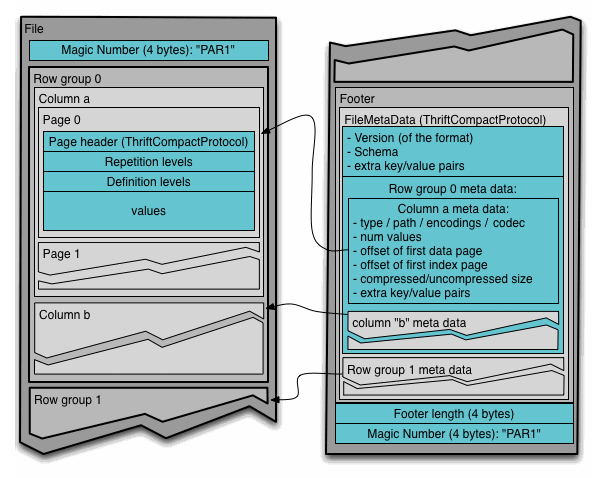

# Parquet

&emsp;

- *[`@loaders.gl/parquet`](/docs/modules/parquet)*
- *[Parquet](https://parquet.apache.org/docs/file-format/)*

Parquet is a binary columnar format optimized for compact storage on disk.

The GitHUB specification of [Apache Parquet](https://github.com/apache/parquet-format/blob/master/README.md).

## Pages

columns can be divided into pages (similar to Apache Arrow record batches) so that partial columns covering a range of rows can be read without reading the entire file.

## Alternatives

In contrast to Arrow which is designed to minimize serialization and deserialization, Parquet is optimized for storage on disk.

## Compression

Since Parquet is designed for read-write access, compression is applied per column chunk.

A wide range of compression codecs are supported. Internal parquet compression formats.

| Type           | Read | Write |
| -------------- | ---- | ----- |
| `UNCOMPRESSED` | ✅    | ✅     |
| `GZIP`         | ✅    | ✅     |
| `SNAPPY`       | ✅    | ✅     |                                                                         |
| `BROTLI`       | ✅    | No    |                                                                         |
| `LZO`          | ❌    | ❌     | There is currently no readily available browser-based LZO module for JS |
| `LZ4`          | ✅    | ✅     |
| `LZ4_RAW`      | ✅    | ✅     |
| `ZSTD`         | ✅    | ✅     |                                                                         |

## Encoding

Some encodings are intended to improve successive column compression by organizing data so that it is less random.

The following Parquet encodings are supported:

| Encoding                  | Read | Write | Types                                                                                                                                                                    |
| ------------------------- | ---- | ----- | ------------------------------------------------------------------------------------------------------------------------------------------------------------------------ |
| `PLAIN`                   | ✅    | ✅     | All                                                                                                                                                                      |
| `PLAIN_DICTIONARY`        | ✅    | ✅     | All                                                                                                                                                                      |
| `RLE_DICTIONARY`          | ✅    | ❌     | All                                                                                                                                                                      |
| `DELTA_BINARY_PACKED`     | ❌    | ❌     | `INT32`, `INT64`, `INT_8`, `INT_16`, `INT_32`, `INT_64`, `UINT_8`, `UINT_16`, `UINT_32`, `UINT_64`, `TIME_MILLIS`, `TIME_MICROS`, `TIMESTAMP_MILLIS`, `TIMESTAMP_MICROS` |
| `DELTA_BYTE_ARRAY`        | ❌    | ❌     | `BYTE_ARRAY`, `UTF8`                                                                                                                                                     |
| `DELTA_LENGTH_BYTE_ARRAY` | ❌    | ❌     | `BYTE_ARRAY`, `UTF8`                                                                                                                                                     |

## Repetition

There are three repetition types in Parquet:

| Repetition | Supported |
| ---------- | --------- |
| `REQUIRED` | ✅         |
| `OPTIONAL` | ✅         |
| `REPEATED` | ✅         |

### Record Shredding

The optional and repeated flags allow for very flexible, nested JSON like data storage in table cells.

The algorithm for compacting is referred to as [Record Shredding](https://www.joekearney.co.uk/posts/understanding-record-shredding)

## Types

TBA - This table is not complete

| Name                | Type                                                                                            | Supported |
| ------------------- | ----------------------------------------------------------------------------------------------- | --------- |
| `bool`              | `BOOLEAN"`                                                                                      |           |
| `int32`             | `INT32"`                                                                                        |           |
| `int64`             | `INT64"`                                                                                        |           |
| `int96`             | `INT96"`                                                                                        |           |
| `float`             | `FLOAT"`                                                                                        |           |
| `double`            | `DOUBLE"`                                                                                       |           |
| `bytearray`         | `BYTE_ARRAY"`                                                                                   |           |
| `FixedLenByteArray` | `FIXED_LEN_BYTE_ARRAY, length=10"`                                                              |           |
| `utf8`              | `BYTE_ARRAY, convertedtype=UTF8, encoding=PLAIN_DICTIONARY"`                                    |           |
| `int_8`             | `INT32, convertedtype=INT32, convertedtype=INT_8"`                                              |           |
| `int_16`            | `INT32, convertedtype=INT_16"`                                                                  |           |
| `int_32`            | `INT32, convertedtype=INT_32"`                                                                  |           |
| `int_64`            | `INT64, convertedtype=INT_64"`                                                                  |           |
| `uint_8`            | `INT32, convertedtype=UINT_8"`                                                                  |           |
| `uint_16`           | `INT32, convertedtype=UINT_16"`                                                                 |           |
| `uint_32`           | `INT32, convertedtype=UINT_32"`                                                                 |           |
| `uint_64`           | `INT64, convertedtype=UINT_64"`                                                                 |           |
| `date`              | `INT32, convertedtype=DATE"`                                                                    |           |
| `date2`             | `INT32, convertedtype=DATE, logicaltype=DATE"`                                                  |           |
| `timemillis`        | `INT32, convertedtype=TIME_MILLIS"`                                                             |           |
| `timemillis2`       | `INT32, logicaltype=TIME, logicaltype.isadjustedtoutc=true, logicaltype.unit=MILLIS"`           |           |
| `timemicros`        | `INT64, convertedtype=TIME_MICROS"`                                                             |           |
| `timemicros2`       | `INT64, logicaltype=TIME, logicaltype.isadjustedtoutc=false, logicaltype.unit=MICROS"`          |           |
| `timestampmillis`   | `INT64, convertedtype=TIMESTAMP_MILLIS"`                                                        |           |
| `timestampmillis2`  | `INT64, logicaltype=TIMESTAMP, logicaltype.isadjustedtoutc=true, logicaltype.unit=MILLIS"`      |           |
| `timestampmicros`   | `INT64, convertedtype=TIMESTAMP_MICROS"`                                                        |           |
| `timestampmicros2`  | `INT64, logicaltype=TIMESTAMP, logicaltype.isadjustedtoutc=false, logicaltype.unit=MICROS"`     |           |
| `interval`          | `BYTE_ARRAY, convertedtype=INTERVAL"`                                                           |           |
| `decimal1`          | `INT32, convertedtype=DECIMAL, scale=2, precision=9"`                                           |           |
| `decimal2`          | `INT64, convertedtype=DECIMAL, scale=2, precision=18"`                                          |           |
| `decimal3`          | `FIXED_LEN_BYTE_ARRAY, convertedtype=DECIMAL, scale=2, precision=10, length=12"`                |           |
| `decimal4`          | `BYTE_ARRAY, convertedtype=DECIMAL, scale=2, precision=20"`                                     |           |
| `decimal5`          | `INT32, logicaltype=DECIMAL, logicaltype.precision=10, logicaltype.scale=2"`                    |           |
| `parquet`           | `map, type=MAP, convertedtype=MAP, keytype=BYTE_ARRAY, keyconvertedtype=UTF8, valuetype=INT32"` |           |
| `list`              | `MAP` convertedtype=LIST, valuetype=BYTE_ARRAY, valueconvertedtype=UTF8                         |           |
| `repeated           | `INT32` repetitiontype=REPEATED"`                                                               |           |

## Format Structure

