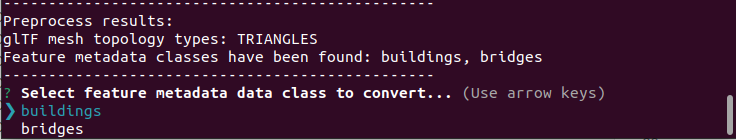

# Tile Converter

<p class="badges">
  
  <a href="https://badge.fury.io/js/%40loaders.gl%2Ftile-converter">
    
  </a>
  <a href="https://hub.docker.com/r/visgl/tile-converter/tags">
    
  </a>
</p>

The `tile-converter` is a command line utility (CLI) for two-way batch conversion between [I3S](https://www.ogc.org/standards/i3s) and [3D Tiles](https://www.ogc.org/standards/3DTiles), both an OGC community standard. It can load tilesets to be converted directly from an URL or file based formats. I3S and 3DTiles are large formats that include different layer types and data formats. See [Supported Features](/docs/modules/tile-converter/cli-reference/supported-features) page that describes what the tile-converter supports.

## Installation

The tile-converter is published as an npm module and as a docker image.

Installing `@loaders.gl/tile-converter` from npm makes the `tile-converter` command line tool available.

```bash
npm i @loaders.gl/tile-converter
```

## Usage

Tile Converter can be run using `npx`.

Aknowledge available options:

```bash
npx tile-converter --help
```

Install dependencies:

```bash
npx tile-converter --install-dependencies
```

Run conversion:

```bash
npx tile-converter --input-type \<I3S\|3DTILES\> --tileset \<tileset\> --name <tileset name> [--output <output folder>] [--no-draco] [--max-depth 4] [--slpk] [--7zExe <path/to/7z.exe>] [--token <ION token>] [--egm <pat/to/*.pgm>] [--split-nodes] [--instant-node-writing] [--generate-textures] [--generate-bounding-volumes]
```

Alternatively, you can use syntax with the equal sign:

```bash
npx tile-converter --input-type=\<I3S\|3DTILES\> --tileset=<tileset> --splk=true|false ...
```

Alternatively, there is a docker image to run:

```bash
docker pull visgl/tile-converter
```

See more details [here](#docker-image)

## Supported Platforms

Operationg Systems: Windows 8.1 or higher, Ubuntu 20.04 or higher

NodeJS 14 or higher is required.

## Options

| Option                    | 3DTiles to I3S conversion | I3S to 3DTiles conversion | Description                                                                                                                                                                                                                                                                                                                                                                                                                                                                                                                                                                                                                                                                                                                                                       |
| ------------------------- | ------------------------- | ------------------------- | ----------------------------------------------------------------------------------------------------------------------------------------------------------------------------------------------------------------------------------------------------------------------------------------------------------------------------------------------------------------------------------------------------------------------------------------------------------------------------------------------------------------------------------------------------------------------------------------------------------------------------------------------------------------------------------------------------------------------------------------------------------------- |
| help                      | \*                        | \*                        | Show the converter tool options list                                                                                                                                                                                                                                                                                                                                                                                                                                                                                                                                                                                                                                                                                                                              |
| install-dependencies      |                           |                           | Run the script for installing dependencies. Run this options separate from others. It installs "\*.pgm" Earth Gravity Model, loader workers, sharp and join-images npm packages                                                                                                                                                                                                                                                                                                                                                                                                                                                                                                                                                                                   |
| input-type                | \*                        | \*                        | "I3S" - for I3S to 3DTiles conversion, "3DTILES" for 3DTiles to I3S conversion                                                                                                                                                                                                                                                                                                                                                                                                                                                                                                                                                                                                                                                                                    |
| tileset                   | \*                        | \*                        | "tileset.json" file (3DTiles) / "http://..../SceneServer/layers/0" resource (I3S)                                                                                                                                                                                                                                                                                                                                                                                                                                                                                                                                                                                                                                                                                 |
| output                    | \*                        | \*                        | Output folder. This folder will be created by converter if doesn't exist. It is relative to the converter path. Default: "./data" folder                                                                                                                                                                                                                                                                                                                                                                                                                                                                                                                                                                                                                          |
| name                      | \*                        | \*                        | Tileset name. This option is required for naming in the output json resouces and for the output `path/\*.slpk` file naming                                                                                                                                                                                                                                                                                                                                                                                                                                                                                                                                                                                                                                        |
| max-depth                 | \*                        | \*                        | Maximal depth of the hierarchical tiles tree traversal, default: infinity                                                                                                                                                                                                                                                                                                                                                                                                                                                                                                                                                                                                                                                                                         |
| slpk                      | \*                        |                           | Whether the converter generates \*.slpk (Scene Layer Package) I3S output files                                                                                                                                                                                                                                                                                                                                                                                                                                                                                                                                                                                                                                                                                    |
| 7zExe                     | \*                        |                           | location of 7z.exe archiver to create slpk on Windows OS, default: "C:\\Program Files\\7-Zip\\7z.exe"                                                                                                                                                                                                                                                                                                                                                                                                                                                                                                                                                                                                                                                             |
| egm                       | \*                        | \*                        | location of the Earth Gravity Model (\*.pgm) file to convert heights from ellipsoidal to gravity-related format, default: "./deps/egm2008-5.pgm". A model file can be loaded from GeographicLib https://geographiclib.sourceforge.io/html/geoid.html                                                                                                                                                                                                                                                                                                                                                                                                                                                                                                              |
| token                     | \*                        |                           | Token for Cesium ION tileset authentication.                                                                                                                                                                                                                                                                                                                                                                                                                                                                                                                                                                                                                                                                                                                      |
| no-draco                  | \*                        |                           | Disable draco compression for geometry. Default: not set                                                                                                                                                                                                                                                                                                                                                                                                                                                                                                                                                                                                                                                                                                          |
| instant-node-writing      | \*                        |                           | Whether the converter should keep JSON resources ([3DNodeIndexDocuments](https://github.com/Esri/i3s-spec/blob/master/docs/1.8/3DNodeIndexDocument.cmn.md) and [nodePages](https://github.com/Esri/i3s-spec/blob/master/docs/1.8/nodePage.cmn.md)) on disk during conversion. The default behavior is the converter keeps JSON resources in memory till the end of conversion. Those resources need to be updated during conversion (adding child nodes and neighbor nodes). If this option is set `true` the converter will keep JSON resources on disk all the time. Use this option for large datasets when the nodes tree is large and "memory overflow" error occurs. Instant node writing saves memory usage in cost of conversion speed (>2 times slower). |
| split-nodes               | \*                        |                           | The converter will generate new node for every PBR material in the glTF file. Prevent merge of similar materials that could lead to incorrect visualization. By default, the converter tries to merge PBR materials to create one node for all primitives in a glTF file. Note can cause refinement issues because "leaf" nodes are generated in the middle of the nodes tree tree                                                                                                                                                                                                                                                                                                                                                                                |
| generate-textures         | \*                        |                           | Create compressed KTX2 textures if non-compressed (JPG, PNG) texture is presented in the input tileset or generate JPG texture if compressed KTX2 is presented in the input tileset                                                                                                                                                                                                                                                                                                                                                                                                                                                                                                                                                                               |
| generate-bounding-volumes | \*                        |                           | Create new OBB and MBS bounding volumes from geometry instead of conversion it from the source tile bounding volume                                                                                                                                                                                                                                                                                                                                                                                                                                                                                                                                                                                                                                               |
| metadata-class            | \*                        |                           | Set metadata class related to EXT_feature_metadata or EXT_structural_meatadata extensions. See details [below](#metadata-class-selection)                                                                                                                                                                                                                                                                                                                                                                                                                                                                                                                                                                                                                         |
| analyze                   | \*                        | \*                        | Analyze the input tileset content without conversion                                                                                                                                                                                                                                                                                                                                                                                                                                                                                                                                                                                                                                                                                                              |
| quiet                     | \*                        | \*                        | Skip user prompts during conversion. Tile-converter won't stop to wait for an action from a user. See details [below](#quiet-mode)                                                                                                                                                                                                                                                                                                                                                                                                                                                                                                                                                                                                                                    |
| validate                  | \*                        |                           | Perform counting of all tiles. Check whether a particular child node fits into the parent one or not. If not, warn about it.                                                                                                                                                                                                                                                                                                                                                                                                                                                                                                                                                                                                                                      |
| add-hash                  |                           |                           | Adds hash file to the SLPK with no one. Provide the slpk name in the `--tileset ` option and updated SLPK path to the `--output` (optional)                                                                                                                                                                                                                                                                                                                                                                                                                                                                                                                                                                                                                       |

## Metadata class selection

_This topic is applicable only for source type "3DTILES"._

An input glTF resource may contain [EXT_feature_metadata](https://github.com/CesiumGS/glTF/blob/3d-tiles-next/extensions/2.0/Vendor/EXT_feature_metadata/README.md) or [EXT_structural_metadata](https://github.com/CesiumGS/glTF/blob/3d-tiles-next/extensions/2.0/Vendor/EXT_structural_metadata/README.md) extensions.

Those extensions provide the structural metadata storage. Metadata - represented as entities and properties - may be closely associated with parts of 3D content, with data representations appropriate for large, distributed datasets. For the most detailed use cases, properties allow vertex- and texel-level associations; higher-level property associations are also supported.

One glTF resource might include more than one metadata class. That means that parts of a mesh might be associated with different sets of properties.
For example, the glTF might have `bridges` and `buildings` classes. In that case, one part of the mesh is related to `bridges` properties (eg. `construction_year`, `type`) and another part of the mesh is related to `buildings` properties (eg. `construction_year`, `height`, `number_of_floors`, `ownership`).

On another side there is an output I3S layer that doesn't support structural metadata and multiple classes. I3S has [feature attributes](https://github.com/Esri/i3s-spec/blob/master/docs/1.9/attributeStorageInfo.cmn.md) metadata that is the same for every node in the layer. So I3S can consume only one set of properties.

In case when the input 3DTiles dataset has multiple metadata classes, the tile-converter provides a promt to select one class from the list:



If the wanted class is known before the conversion it is possible to skip the prompt with setting `metadata-class` option. For example:

```bash
npx tile-converter --input-type 3DTILES --tileset ..... --metadata-class bridges
```

## Quiet mode

Use `--quet` option to avoid user prompts during conversion. In some cases, tile-converter stops and waits for an input from a user, for example, asks weither resume conversion or start a new one.

```bash
npx tile-converter ..... --quiet
```

With `--quiet` option, tile-converter won't ask a user to make a decision, it will do a default action instead.

### `--add-hash` and `--quiet`

In `--add-hash` case tile-converter offers to create a new file or modify the existing SLPK. With `--quiet` option, the existing SLPK will be modified.

### Resume conversion with `--quiet` option

Resume conversion is a feature that allows to resume a conversion that was unpredictably stopped, for example when terminal was closed or a user pressed `CTRL+C`. When converter detects a previous conversion, it offers to resume it or start a new one.
With `--quiet` option, tile-converter will resume. To start a new conversion with `--quiet` option, remove output folder that was created by tile-converter before.

### Metadata class selection with `--quiet` option

_This topic is applicable only for source type "3DTILES"._

This case is applicable for the specific type of datasets. See [Metadata class selection](#metadata-class-selection).
With `--quiet` option and when multiple metadata classes was detected, tile-converter will stop. To convert such a dataset with `--quiet` option, use `--metadata-class` option to select a metadata class.

## Running local server to handle I3S layer

After conversion without `--slpk` option a new I3S layer is created in output ("data" by default) directory.

Run it with the local web server:

```bash
PORT=8080 HTTPS_PORT=4443 I3sLayerPath="./data" DEBUG=i3s-server:* npx i3s-server
```

See more details [here](/docs/modules/tile-converter/cli-reference/i3s-server)

### Show converted layer on a map

```
open https://loaders.gl/examples/i3s?url=http://localhost:8080/NewLayerName/SceneServer/layers/0
```

## Docker image

The tile converter is available as a docker image in the [visgl/tile-converter](https://hub.docker.com/r/visgl/tile-converter/tags) dockerhub repo. The advantage of docker image is that it has dependencies pre-installed so it is not necessary to call `npx tile-converter --install-dependencies`.

To download the tile-converter docker image, run:

```bash
docker pull visgl/tile-converter
```

To use converter run:

```bash
docker run \
  --rm  \
  -v /path/to/output_folder:/loaders-bundle/data \
  -v /path/to/input-tileset:/loaders-bundle/input-data \
  visgl/tile-converter \
  --input-type 3dtiles \
  --token ... \
  --tileset input-data/tileset.json \
  --name ... \
  --output data \
  --max-depth 3 \
  ...
```

Docker run arguments:

`-v` - Create docker volume, linked to internal data folder

`--rm` - Remove container after conversion

`visgl/tile-converter` - Image name

To build your own tile-converter docker image:

- Clone [loaders.gl](https://github.com/visgl/loaders.gl) project.
- In root folder of the project run:

```bash
  yarn bootstrap
  docker build -t [docker_image_name] -f modules/tile-converter/Dockerfile .
```

- Push docker image to your docker hub
